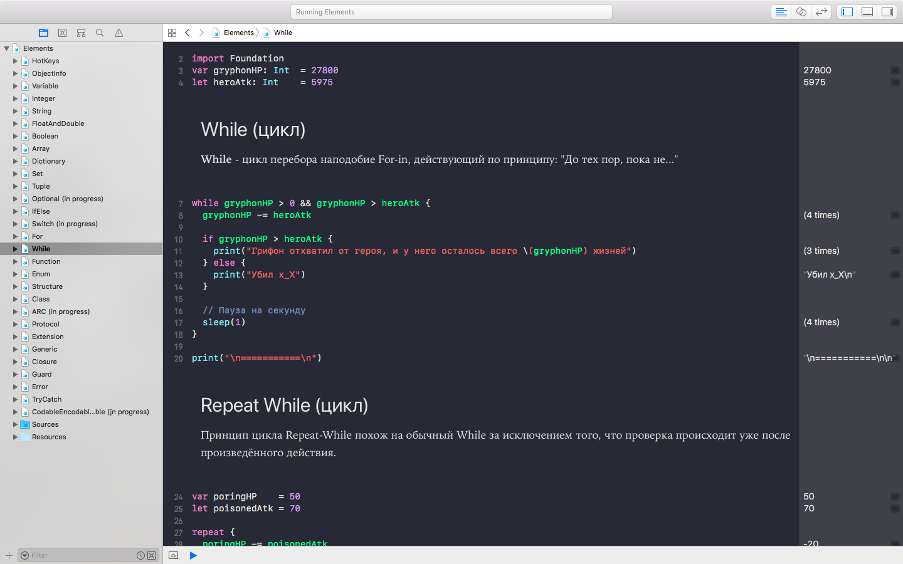

# Swift Elements
Учебное пособие по основам языка программирования **Swift** в формате **Playground**

> *Note:* Чтобы оформление Playground-файла было как на изображении ниже (если вдруг оно отключено), вам необходимо его включить в меню: **Editor -> Show Rendered Markup**

# Roadmap

* [x] [Hot keys](https://github.com/riley-usagi/swift_elements/tree/master/Elements.playground/Pages/HotKeys.xcplaygroundpage/Contents.swift)
  * [x] Вступление
  * [x] Горячие клавиши
* [x] [Object Info](https://github.com/riley-usagi/swift_elements/tree/master/Elements.playground/Pages/ObjectInfo.xcplaygroundpage/Contents.swift)
* [x] [Переменные и константы](https://github.com/riley-usagi/swift_elements/tree/master/Elements.playground/Pages/Variables.xcplaygroundpage/Contents.swift)
  * [x] Переменная
  * [x] Константа
* [x] [Integers](https://github.com/riley-usagi/swift_elements/tree/master/Elements.playground/Pages/Integers.xcplaygroundpage/Contents.swift)
* [x] [String](https://github.com/riley-usagi/swift_elements/tree/master/Elements.playground/Pages/String.xcplaygroundpage/Contents.swift)
* [x] [Float и Double](https://github.com/riley-usagi/swift_elements/tree/master/Elements.playground/Pages/FloatAndDouble.xcplaygroundpage/Contents.swift)
* [x] [Boolean](https://github.com/riley-usagi/swift_elements/tree/master/Elements.playground/Pages/Boolean.xcplaygroundpage/Contents.swift)
* [x] [Array](https://github.com/riley-usagi/swift_elements/tree/master/Elements.playground/Pages/Array.xcplaygroundpage/Contents.swift)
* [x] [Dictionary](https://github.com/riley-usagi/swift_elements/tree/master/Elements.playground/Pages/Dictionary.xcplaygroundpage/Contents.swift)
* [x] [Set](https://github.com/riley-usagi/swift_elements/tree/master/Elements.playground/Pages/Set.xcplaygroundpage/Contents.swift)
* [x] [Tuple](https://github.com/riley-usagi/swift_elements/tree/master/Elements.playground/Pages/Tuple.xcplaygroundpage/Contents.swift)
* [ ] [Optional](https://github.com/riley-usagi/swift_elements/tree/master/Elements.playground/Pages/Optional%20(in%20progress).xcplaygroundpage/Contents.swift)
* [x] [If Else](https://github.com/riley-usagi/swift_elements/tree/master/Elements.playground/Pages/IfElse.xcplaygroundpage/Contents.swift)
* [ ] Switch
* [x] [For](https://github.com/riley-usagi/swift_elements/tree/master/Elements.playground/Pages/For.xcplaygroundpage/Contents.swift)
  * [x] Stride
  * [x] Where
* [x] [While](https://github.com/riley-usagi/swift_elements/tree/master/Elements.playground/Pages/While.xcplaygroundpage/Contents.swift)
  * [x] Repeat while
  * [x] Continue
  * [x] Break
* [x] [Function](https://github.com/riley-usagi/swift_elements/tree/master/Elements.playground/Pages/Function.xcplaygroundpage/Contents.swift)
  * [x] Необязательные параметры
  * [x] Стандартное значение параметра
  * [x] Inout
* [x] [Enum](https://github.com/riley-usagi/swift_elements/tree/master/Elements.playground/Pages/Enum.xcplaygroundpage/Contents.swift)
  * [x] Перечисления со значениями
  * [x] Связанные значения
* [ ] [Structure](https://github.com/riley-usagi/swift_elements/tree/master/Elements.playground/Pages/Structure%20(in%20progress).xcplaygroundpage/Contents.swift)
  * [ ] Вычисляемые свойства
  * [x] Наблюдатели свойств
  * [x] Методы
  * [x] Конструкторы
  * [x] Опциональный конструктор
* [x] [Class](https://github.com/riley-usagi/swift_elements/tree/master/Elements.playground/Pages/Class.xcplaygroundpage/Contents.swift)
* [ ] ARC
* [x] [Protocol](https://github.com/riley-usagi/swift_elements/tree/master/Elements.playground/Pages/Protocol.xcplaygroundpage/Contents.swift)
* [x] [Extension](https://github.com/riley-usagi/swift_elements/tree/master/Elements.playground/Pages/Extension.xcplaygroundpage/Contents.swift)
* [x] [Generic](https://github.com/riley-usagi/swift_elements/tree/master/Elements.playground/Pages/Generic.xcplaygroundpage/Contents.swift)
* [x] [Closure](https://github.com/riley-usagi/swift_elements/tree/master/Elements.playground/Pages/Closure.xcplaygroundpage/Contents.swift)
* [x] [Guard](https://github.com/riley-usagi/swift_elements/tree/master/Elements.playground/Pages/Guard.xcplaygroundpage/Contents.swift)
* [x] [Error](https://github.com/riley-usagi/swift_elements/tree/master/Elements.playground/Pages/Error.xcplaygroundpage/Contents.swift)
* [x] [Try / Catch](https://github.com/riley-usagi/swift_elements/tree/master/Elements.playground/Pages/TryCatch.xcplaygroundpage/Contents.swift)
